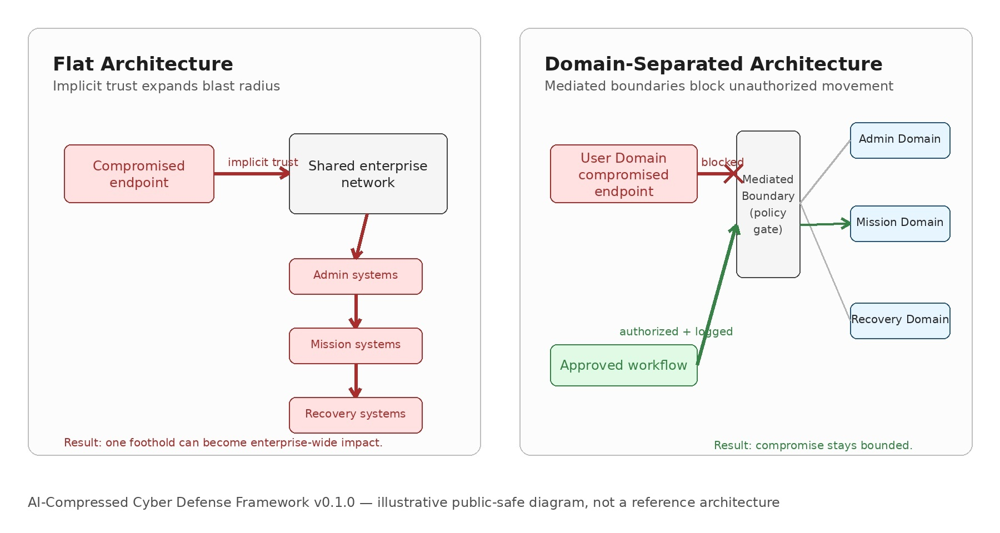

# AI-Compressed Cyber Defense Framework

**Structural security for AI-compressed cyberattacks**

> A public-safe defensive framework for engineering mission-resilient systems against AI-accelerated vulnerability discovery, exploit validation, multi-step attack reasoning, lateral movement, and post-compromise escalation.

**Version:** v0.1.0 (Initial Public Release)
**Status:** Initial public defensive framework for assessment, architecture review, and evidence-based hardening
**License:** Apache 2.0 (see LICENSE)

---

## Core Thesis

As AI compresses the time required to discover, validate, chain, and operationalize vulnerabilities, defenders must move beyond perimeter controls and **engineer systems so that compromise remains bounded**, mission functions remain resilient, and trust boundaries are explicit, mediated, and verifiable.

Traditional cybersecurity often assumes the defender has time to detect, triage, and respond after initial compromise. **AI-compressed cyberattacks** weaken that assumption. When vulnerability discovery, exploit development, and attack-path reasoning become faster and cheaper, flat architectures become increasingly fragile.

**The defensive answer is not just more monitoring.**

**The defensive answer is structural security.**

A mission-resilient system ensures that:

- One compromised endpoint does **not** expose the entire enterprise
- User domains cannot directly reach administrative or mission-critical domains
- Administrative authority is isolated from ordinary user activity
- Mission systems are separated from business and productivity systems
- Cross-domain flows are explicit, mediated, logged, and testable
- Recovery, backup, maintenance, and update states remain protected
- Security claims are supported by **evidence**, not assumptions

---

## Why This Framework Exists

Frontier AI models have demonstrated the ability to accelerate vulnerability discovery and multi-step security reasoning in controlled and adversarial contexts. When comparable capabilities become broadly accessible, organizations relying on implicit trust and flat network architectures face significantly elevated risk.

This framework provides a **documentation-based defensive framework** for architectural assessment, architecture review, and evidence-based hardening. It is not another monitoring tool, not executable software, and not a compliance checklist.

It is grounded in **NIST Special Publication 800-160, Volume 1, Revision 1 — Engineering Trustworthy Secure Systems**, with particular emphasis on the foundational principle of **domain separation** and its complementary design principles.

---

## Included Artifacts (v0.1.0)

This repository delivers a usable starter package for defensive assessment and architecture review:

### Core Documentation
- `docs/article-defending-against-ai-compressed-cyberattacks.md` — Full public-safe article on structural defense
- `docs/threat-model.md` — AI-compressed cyber threat characteristics and post-compromise focus
- `docs/structural-security-principles.md` — Detailed explanation of domain separation + complementary principles
- `docs/nist-sp-800-160-mapping.md` — Traceability matrix from NIST principles to this framework’s artifacts
- `docs/public-safe-claims.md` — Explicit boundaries on what this framework asserts and does not assert

### Checklists
- `checklists/ai-compressed-readiness-checklist.md`
- `checklists/domain-separation-assessment.md`
- `checklists/privileged-access-isolation-checklist.md`
- `checklists/recovery-state-protection-checklist.md`

### Templates
- `templates/domain-boundary-inventory.md`
- `templates/authorized-flow-matrix.md`
- `templates/attack-path-review.md`
- `templates/boundary-enforcement-test-plan.md`
- `templates/telemetry-map.md`
- `templates/evidence-card-template.md`

### Examples
- `examples/sample-mission-system-boundary-map.md`

---

## Visual: Domain Separation Limits Blast Radius



*Alt text: The diagram compares a flat architecture where implicit trust allows one compromised endpoint to expand enterprise-wide impact with a domain-separated architecture where unauthorized movement is blocked at a mediated boundary and approved workflows are authorized and logged.*

**Left:** Traditional flat architecture — single compromised endpoint leads to full enterprise / mission impact.
**Right:** Domain-separated architecture — compromise is contained within the affected domain; cross-domain movement requires explicit, mediated, logged authorization.

---

## Intended Users

This framework is designed for:

- Security architects and systems engineers
- Mission assurance and critical infrastructure teams
- Cybersecurity governance, risk, and compliance (GRC) teams
- Public-sector and high-consequence technology programs
- AI governance and cyber-risk leaders
- Boards and executives evaluating AI-era resilience
- Organizations operating OT/ICS, cloud, identity, recovery, or other high-consequence systems

---

## Public-Safe Boundary (Important)

**This repository is strictly defensive.**

It does **not** contain:
- Exploit code or zero-day details
- Target-specific tactics, techniques, or procedures (TTPs)
- Offensive procedures, malware, or credential-abuse instructions
- Instructions for unauthorized access or system compromise

All discussion of adversary behavior or AI capabilities is included **only** at the level necessary to support defensive architecture decisions, risk assessment, and systems security engineering.

Models with advanced vulnerability discovery and reasoning capabilities could be misused by adversaries if comparable capabilities become broadly accessible. This framework helps organizations prepare for that possibility through structural design rather than reliance on detection speed alone.

---

## Core Principle

> Trustworthy secure systems are not built by adding more tools to flat architectures.
>
> They are built by engineering systems so that damaging attacks are **structurally difficult**, **operationally visible**, and **mission-limited** even when initial compromise occurs.
>
> The failure mode is not inadequate technology.
> **The failure mode is inadequate engineering.**

---

## 5-Minute Quickstart

1. Pick one critical system, enclave, or mission workflow.
2. Open `checklists/ai-compressed-readiness-checklist.md`.
3. Score each item as Strong, Partial, Weak, or N/A.
4. Create two starter artifacts:
   - `templates/domain-boundary-inventory.md`
   - `templates/authorized-flow-matrix.md`
5. Record one evidence claim using `templates/evidence-card-template.md`.

Do not start with the whole enterprise. Start with one system boundary and prove what is true.

## Full Getting Started Path

1. Read the full article: `docs/article-defending-against-ai-compressed-cyberattacks.md`.
2. Run the readiness checklist against one critical system or enclave.
3. Complete a Domain Boundary Inventory and Authorized Flow Matrix.
4. Use the Evidence Card Template to document claims about the current architecture.
5. Map findings to `docs/nist-sp-800-160-mapping.md`.
6. Convert the largest gaps into an architecture hardening backlog.

Repeat for additional domains or systems. The goal is progressive architectural hardening supported by verifiable evidence.

---

## Repository Topics (Recommended for GitHub)

`cybersecurity` `ai-security` `security-engineering` `systems-security` `zero-trust` `mission-resilience` `nist-sp-800-160` `critical-infrastructure` `ai-governance` `threat-modeling` `domain-separation` `secure-by-design`

---


## Source Grounding

**Last external source verification date:** 2026-06-29

This framework is grounded in public, defensive sources including:

- NIST SP 800-160 Vol. 1 Rev. 1, *Engineering Trustworthy Secure Systems*
- NIST Taking Measure, *Rethinking Cybersecurity from the Inside Out*
- public Anthropic Project Glasswing materials and UK AI Security Institute cyber-evaluation materials, used only for evidence grounding and not as project branding
- Public defensive discussions of AI-accelerated vulnerability discovery and remediation throughput

Use `docs/sources-and-evidence.md` for source tracking and claim review.

---

## Citation

If you use this framework in publications, assessments, or policy work, please cite:

```bibtex
@misc{ai-compressed-cyber-defense-framework-v0.1.0,
  title        = {AI-Compressed Cyber Defense Framework: Structural Security for AI-Compressed Cyberattacks},
  author       = {{AI-Compressed Cyber Defense Framework contributors}},
  year         = {2026},
  version      = {v0.1.0},
  howpublished = {GitHub repository},
  url          = {https://github.com/GLOBAL-AI-GOVERNANCE/ai-compressed-cyber-defense-framework}
}
```

See `CITATION.cff` for machine-readable citation and `NOTICE` for attribution and no-affiliation language.

---

## License

Licensed under the Apache License, Version 2.0. See `LICENSE` file for details.

This framework is provided as a public defensive resource. Contributions that maintain the public-safe boundary and evidence-based approach are welcome.

---

**Built for mission resilience in the age of AI-compressed cyber operations.**
**Structural security. Verifiable evidence. Bounded impact.**

*Initial public release — June 2026*
